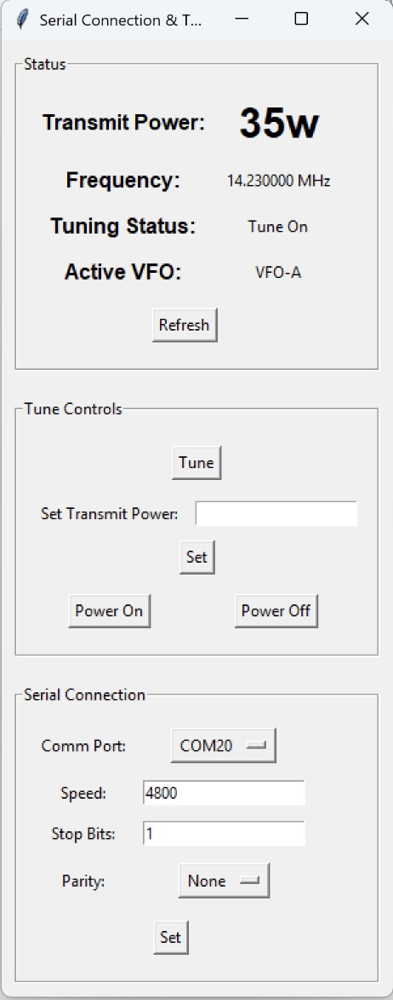

# SimpleYaesuCAT
Simple Yaesu CAT GUI

When using digital modes, there are times where I'd like to issue a tune command, update rf power or turn power on/off.  This is very possible via CAT commands on the Yaseu FT-710 (and other models.)  After working the serial connection directly for some time, it made sense to make a simple UI.  CAT Reference available [here](https://www.yaesu.com/downloadFile.cfm?FileID=17797&FileCatID=158&FileName=FT%2D710%5FCAT%5FOM%5FENG%5F2306%2DC.pdf&FileContentType=application%2Fpdf).

